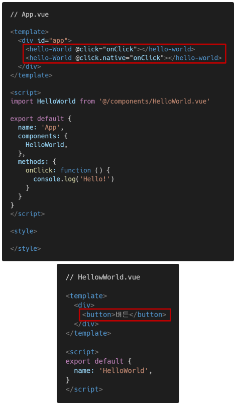
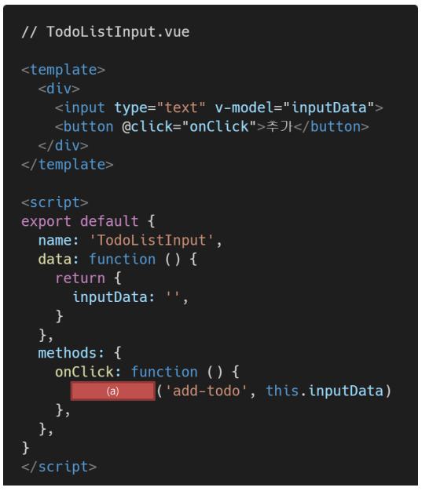
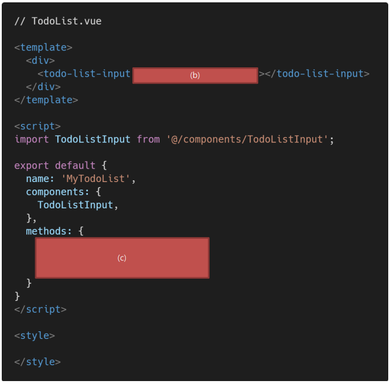

# Vue

### 1. 아래의 설명을 읽고 T/F 여부를 작성하시오. 

- Vue는 컴포넌트 간 양방향 데이터 흐름을 지향하기 때문에 부모, 자식 컴포넌트 간의 데이터 전달 및 수정이 자유롭다. 
- v-on 디렉티브는 해당 요소 또는 컴포넌트에서 특정 이벤트 발생 시 전달받은 함수를 실행한다. 
- 부모 컴포넌트는 props를 통해 자식 컴포넌트에게 이벤트를 보내고, 자식 컴포넌트는 emit을 통해 부모 컴포넌트에게 데이터를 전달한다. 

```
(1) : F
(2) : T
(3) : T
```


### 2. Vue는 단방향 데이터 흐름을 지향하는 프론트엔드 프레임워크다. 공식문서를 참고하여 그 이유를 서술하시오.

```
모든 props는 하위 속성과 상위 속성 사이의 단방향 바인딩을 형성합니다. 상위 속성이 업데이트되면 하위로 흐르게 되지만 그 반대는 안됩니다. 이렇게하면 하위 컴포넌트가 실수로 부모의 상태를 변경하여 앱의 데이터 흐름을 추론하기 더 어렵게 만드는 것을 방지할 수 있습니다.
```


### 3. 아래와 같은 Vue 프로젝트에서 2개의 버튼이 동작하는 것을 비교하여 .native 수식어의 역할을 작성하시오.



```
컴포넌트에서 루트엘리먼트의 네이티브 이벤트를 직접 감지하고 싶은 경우, v-on에 사용할 수 있습니다.
컴포넌트의 루트 엘리먼트에서 네이티브 이벤트를 수신하려는 경우가 있을 수 있습니다. 이러한 경우 v-on 에 .native 수식자를 사용할 수 있습니다.
```


### 4. 다음은 자식 컴포넌트에서 이벤트를 발생시켜 부모 컴포넌트의 함수를 실행하는 코드이다. 빈칸 (a), (b), (c)에 들어갈 코드를 작성하시오. 

- TodoListInput 컴포넌트의 버튼을 누르면 add-todo 이벤트가 발생한다. (이벤트 발생 시 data의 text 값도 함께 전달한다.) 

- TodoList 컴포넌트에서 add-todo 이벤트를 청취하면, onAddTodo 메서드를 실행한다.

- onAddTodo 메서드에서는 TodoListInput 컴포넌트에서 전달받은 값을 console.log 함수를 통해 출력한다.





```
(a) : this.$emit
(b) : @add-todo="onAddTodo"
(c) : 
    onAddTodo: function(data) {
    console.log(data)
    }
```

