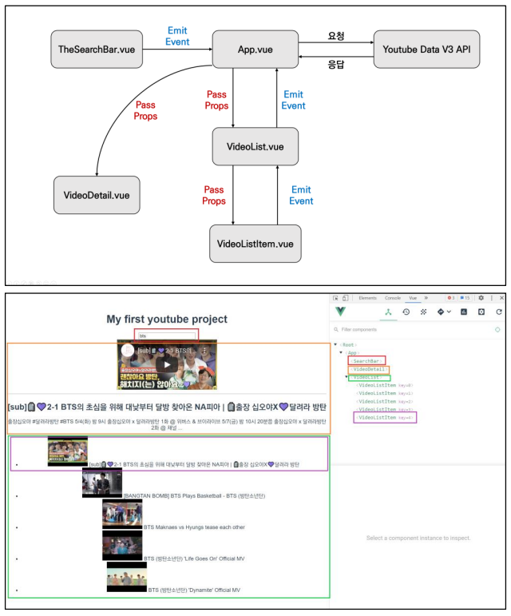
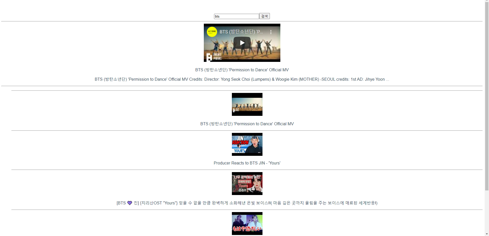

# Vue

### - Background

```
* Vue
```

### - Goal

```
* Vue의 컴포넌트간 데이터 흐름에 대한 이해
```

### - Problem

❖  Vue CLI 및 Youtube API를 활용하여 Youtube 앱을 완성하시오.



```vue
<!-- App.vue -->

<template>
  <div id="app">
    <the-search-bar @search="onSearch"> </the-search-bar>
    <hr>
    <video-detail :select-item="selectItem"></video-detail>
    <hr>
    <video-list :video-list="results" @selected="selectVideo"></video-list>
  </div>
</template>

<script>
import TheSearchBar from '@/components/TheSearchBar'
import axios from 'axios'
import VideoList from '@/components/VideoList'
import VideoDetail from '@/components/VideoDetail'

export default {
  name: 'App',
  components: {
    TheSearchBar,
    VideoList,
    VideoDetail,
  },
  data: function () {
    return {
      keyword: '',
      results: [],
      selectItem: {},
    }
  },
  methods: {
    onSearch: function (data) {
      this.keyword = data
      axios({
        method: 'get',
        url: 'https://www.googleapis.com/youtube/v3/search',
        params: {
          part: 'snippet',
          q: this.keyword,
          // 비디오 내용만 가져옴
          type: 'video',
          key: process.env.VUE_APP_YOUTUBE_API_KEY
        }
      })
      .then(res => {
        // console.log(res.data)
        this.results = res.data.items
      })
      .catch(err => {
        console.log(err)
      })
    },
    selectVideo: function (data) {
    // console.log(data)
    this.selectItem = data
    },
  },
}
</script>

<style>
#app {
  font-family: Avenir, Helvetica, Arial, sans-serif;
  -webkit-font-smoothing: antialiased;
  -moz-osx-font-smoothing: grayscale;
  text-align: center;
  color: #2c3e50;
  margin-top: 60px;
}
</style>
```

```vue
<!-- VideoListItem.vue -->

<template>
  <div @click="selectVideo">
    <hr>
    
    <!-- filters 에 등록된 필터 사용하는 방법 -->
    <p>{{ videoItem.snippet.title | unescapTitle }}</p>
  </div>
</template>

<script>
import _ from 'lodash'

export default {
  name: 'VideoListItem',
  props: {
    videoItem: Object,
  },
  // TEXT 에서 깨지는 문자열을 원래대로 돌려는 filter 메서드
  filters: {
    unescapTitle: function (title) {
      return _.unescape(title)
    }
  },
  methods: {
    selectVideo: function () {
      // 비디오가 클릭되면 부모 데이터로 알려준다.
      this.$emit('selected', this.videoItem)
    }
  }
}
</script>

<style>

</style>
```

```vue
<!-- VideoList.vue -->
<template>
  <div>
    <ul v-if="videoList.length">
    <video-list-item 
      v-for="(video, index) in videoList" 
      :key="index"
      :video-item="video"
      @selected="selectVideo"
      ></video-list-item>
    </ul>
  </div>
</template>

<script>
import VideoListItem from '@/components/VideoListItem'

export default {
  name: 'VideoList',
  props: {
    videoList: Array,
  },
  components: {
    VideoListItem,
  },
  methods: {
    selectVideo: function(data) {
      this.$emit('selected', data)
    }
  }
}
</script>

<style>

</style>
```

```vue
<!-- VideoDetail.vue -->
<template>
  <div>
    <!-- 여기에서 if가 없으면 title, description을 찾을수 없어 에러발생 -->
    <div v-if="isShow">
      <iframe :src="videoUrl" frameborder="0"></iframe>
      <p>{{ selectItem.snippet.title | unescapTitle }}</p>
      <p>{{ selectItem.snippet.description | unescapTitle}}</p>
    </div>
  </div>
</template>

<script>
import _ from 'lodash'

export default {
  name: 'VideoDetail',
  props: {
    selectItem: Object,
  },
  filters: {
    unescapTitle: function (title) {
      return _.unescape(title)
    }
  },
  computed: {
    videoUrl: function () {
      if (_.isEmpty(this.selectItem)) {
        return ''
      } else {
        return `https://www.youtube.com/embed/${this.selectItem.id.videoId}`
      }
    },
    // 전달된 데이터가 없으면 디테일 페이지는 보여줄 필요 없음.
    isShow: function () {
      return !_.isEmpty(this.selectItem)
    }
  }
}
</script>

<style>

</style>
```

```vue
<!-- TheSearchBar.vue -->
<template>
  <div>
  <!-- 트림은 빈 공백 제거 -->
  <!-- 엔터, 클릭 했을 때 부모에게 검색 데이터를 전달 -->
    <input type="text" v-model.trim="searchKeyword" @keyup.enter="onSearch">
    <button @click="onSearch">검색</button>
  </div>
</template>

<script>


export default {
  name: 'TheSearchBar',
  data : function () {
    return {
      searchKeyword: '',
    }
  },
  methods: {
    onSearch: function() {
      if (this.searchKeyword.length !== 0){
        this.$emit('search', this.searchKeyword)
      }
    },
  },
}
</script>

<style>

</style>
```

### - Picture


