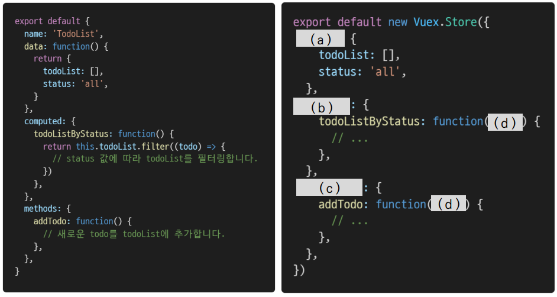

# Vue

### 1. 아래의 설명을 읽고 T/F 여부를 작성하시오. 

- Vue 프로젝트에서 상태 관리를 하기 위해서는 반드시 Vuex를 설치해야 한다.
- mutations는 반드시 state를 수정하기 위해서만 사용되어야 한다.
- mutations는 store.dispatch로, actions는 store.commit으로 호출할 수 있다.
- state는 data의 역할, getters는 computed와 유사한 역할을 담당한다. 

```
(1) : F
(2) : T
(3) : F
(4) : T
```

### 2. Vuex에서 Actions과Mutations의 역할과, 각각에 작성되는 핸들러의 특징을 서술하시오. 

```
Actions : state를 변경하는 대신 mutations를 commit() 메서드로 호출해서 실행, 핸들러 함수는 비동기 작업이 포함될 수 있고 state를 다루지 않음.
Mutations: state를 변경하는 유일한 방법, 핸들러 함수는 반드시 동기적이어야 함
```


### 3. 컴포넌트에 작성된 Todo App 관련 코드를 Vuex의Store로 옮기고자 한다. 빈 칸 (a), (b), (c), (d)에들어갈 코드를 작성하시오.



```
(a) : state
(b) : getters
(c) : mutations
(d) : states
```

