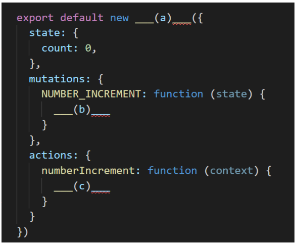
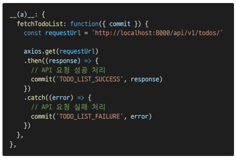
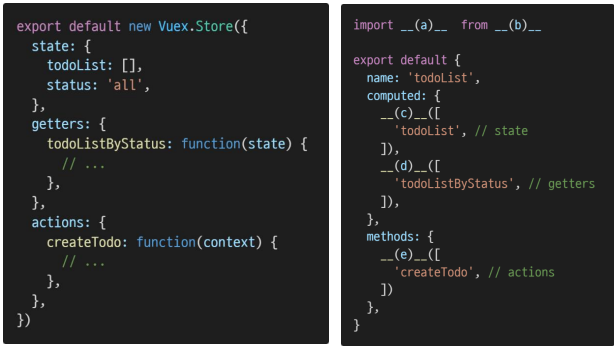

# Vuex

### 1. 다음은 Vuex로 구성된 하나의 숫자를 counting하는 store이다. (a), (b), (c)에 들어갈 코드를 작성하시오. 

• NUMBER_INCREMENT mutation handler가 호출되면 state의 count를 1만큼 증가시킨다.



```
(a) : Vuex.Store
(b) : state.count ++
(c) : context.commit("NUMBER_INCREMENT")
```


### 2. 아래 예시의 함수는 서버로부터 데이터를 가져 온 뒤, 응답 값을 state에 저장하기 위하여 mutations를 호출하는 로직을 수행한다. 이와 같이 비동기 API 및 mutations 호출에 적합한 store의 속성 (a)를 작성하시오.



```
actions
```


### 3. 왼쪽처럼 store에 state, getters, actions가 정의되어 있다. “Component Binding Helpers”를 통해 각 컴포넌트에서 사용하고자 한다. Vuex 공식문서를 참고하여 빈 칸 (a), (b), (c), (d), (e)에 들어갈 코드를 작성하시오.



```
(a) : { mapState, mapGetters, mapActions }
(b) : vuex
(c) : ...mapState
(d) : ...mapGetters
(e) : ...mapActions
```


### 4. store에 정의한 state를 직접 변경하지 않고, mutations를 통해 변경해야 하는 이유를 Vuex 공식문서를 참고하여 작성하시오.

```
모든 상태에 대한 추적이 가능한 기록이 남을 수 있으며 툴을 사용하여 앱을 더 잘 이해할 수 있습니다.
```

