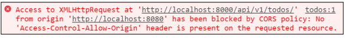
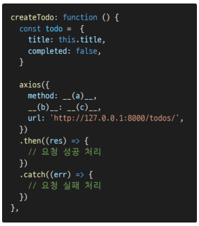

# Vue with server

### 1. 아래의 설명을 읽고 T/F 여부를 작성하시오. 

- Client-Server 모델에서 Vue는 Client 파트, DRF는 Server 파트를 담당한다. 
- Vue는 Django와 동일하게 하나의 웹서버로 운용되며 자체적으로 database 연동, 회원가입 등의 기능이 제공된다.
- Vue의 최종 build된 모습은 브라우저가 받아보는 한 장의 HTML 문서와 서버 측으로부터 응답 받은 리소스로 이루어져 있다.

```
(1) : T
(2) : F
(3) : T
```

### 2. 아래 예시는 Vue에서 Django 서버로 네트워크 요청을 보냈을 때 발생한 에러다. 에러가 발생한 원인과 해결 방법을 작성하시오.



```
원인 : 요청한 리소스에 Access-Control_allow-Origin 헤더가 없기 때문에(port 번호가 달라서) CORS 정책에 의해 차단됨
해결 방법 : Access-Control_allow-Origin 헤더를 추가해준다(서버에 허용되는 출처 등록, header 출처 전달).
```

### 3. 아래 예시는 Vue에서 Django 서버로 Todo 생성 요청을 보내는 코드다. Axios 공식 문서를 참고하여 빈 칸 (a), (b), (c)에 들어갈 코드를 작성하시오.



```
(a) : 'post'
(b) : data
(c) : todo
```

