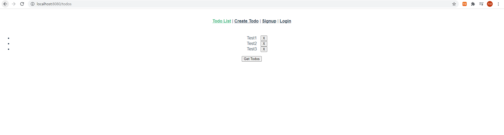

# Vue with server

### - Background

```
* Vue
* Django
```

### - Goal

```
* Django와 Vue를 활용한 Client/Server에 대한 이해
```

### - Problem

❖ 사전 제공된 django와 vue 프로젝트를 통해 아래 요구사항을 만족하는 프로젝트를 구현하시오.

1. Todo 데이터를 가져오는 과정에서발생하는CORS Policy 관련 이슈 해결

   

2. Todo Create & Read 

   • CreateTodo 컴포넌트의 createTodo 메서드 작성 

   • Todo 작성이 성공하면 Vue Router를 사용해 TodoList 컴포넌트로 이동 

   • Get Todos 버튼을 클릭하지 않고도 TodoList 컴포넌트가 생성될 때 Todo 목록을 가져올 수 있도록 수정

3. Todo Delete 

   • TodoList 컴포넌트의 deleteTodo 메서드 작성 

   • Todo 삭제가 성공하면 별도의 새로고침 없이 업데이트 된 Todo 목록을 보여줄 수 있도록 함 

4. Todo Update (+ 실시간취소선 toggle) 

   • TodoList 컴포넌트의 updateTodo 메서드 작성 

   • Todo status가 변경되면 별도의 새로고침 없이 취소선이 toggle 될 수 있도록 함 

[주의사항] 

​		• Django 프로젝트의 views.py는 수정하지 말 것

```python
# settings.py
CORS_ALLOW_ALL_ORIGINS = True

INSTALLED_APPS = [
    # local apps
    'todos',
    'accounts',
    'corsheaders'

    # drf
    'rest_framework',

    'django.contrib.admin',
    'django.contrib.auth',
    'django.contrib.contenttypes',
    'django.contrib.sessions',
    'django.contrib.messages',
    'django.contrib.staticfiles',
]

MIDDLEWARE = [
    'corsheaders.middleware.CorsMiddleware',
    'django.middleware.security.SecurityMiddleware',
    'django.contrib.sessions.middleware.SessionMiddleware',
    'django.middleware.common.CommonMiddleware',
    'django.middleware.csrf.CsrfViewMiddleware',
    'django.contrib.auth.middleware.AuthenticationMiddleware',
    'django.contrib.messages.middleware.MessageMiddleware',
    'django.middleware.clickjacking.XFrameOptionsMiddleware',
]
```

```js
// CreateTodo.vue
methods: {
    createTodo: function () {
      // 2번 문제
      const todoItem = {
        title: this.title,
      }

      if (todoItem.title) {
        axios({
          method: 'post',
          url: 'http://127.0.0.1:8000/todos/',
          data: todoItem
        })
          .then(res => {
            console.log(res)
            // this.$router.push({ name: 'TodoList' })
          })
          .catch(err => {
            console.log(err)
          })
        }
    }
  }
```

```js
// TodoList.vue
deleteTodo: function (todo) {
      // 3번 문제
      axios({
        method: 'delete',
        url: `http://127.0.0.1:8000/todos/${todo.id}/`
      })
        .then(res => {
          console.log(res)
          // this.getTodos()
        })
        .catch(err => {
          console.log(err)
        })
    },
        
updateTodoStatus: function (todo) {
      // 4번 문제
      const todoItem = {
        ...todo,
        is_completed: !todo.is_completed
      }

      axios({
        method: 'put',
        url: `http://127.0.0.1:8000/todos/${todo.id}/`,
        data: todoItem,
      })
        .then(res => {
          console.log(res)
          // todo.is_completed = !todo.is_completed
        })
    },
```


### - Picture



