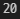
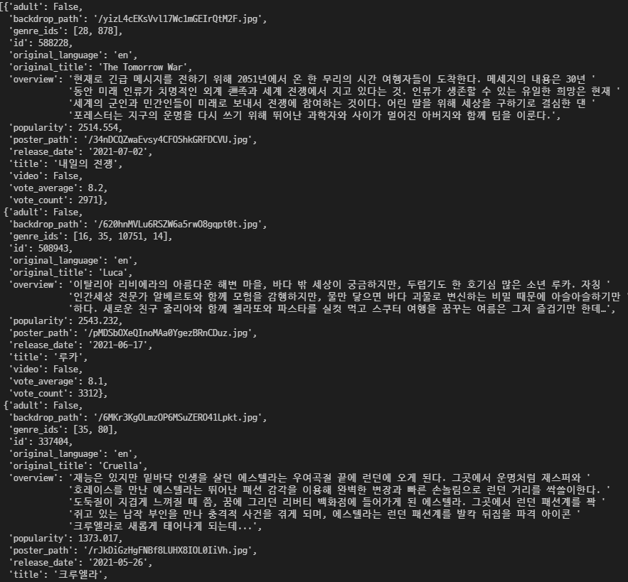
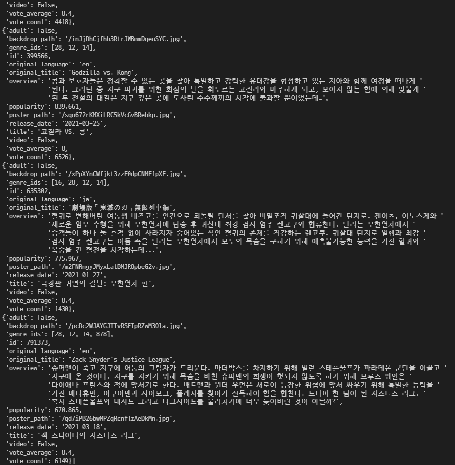
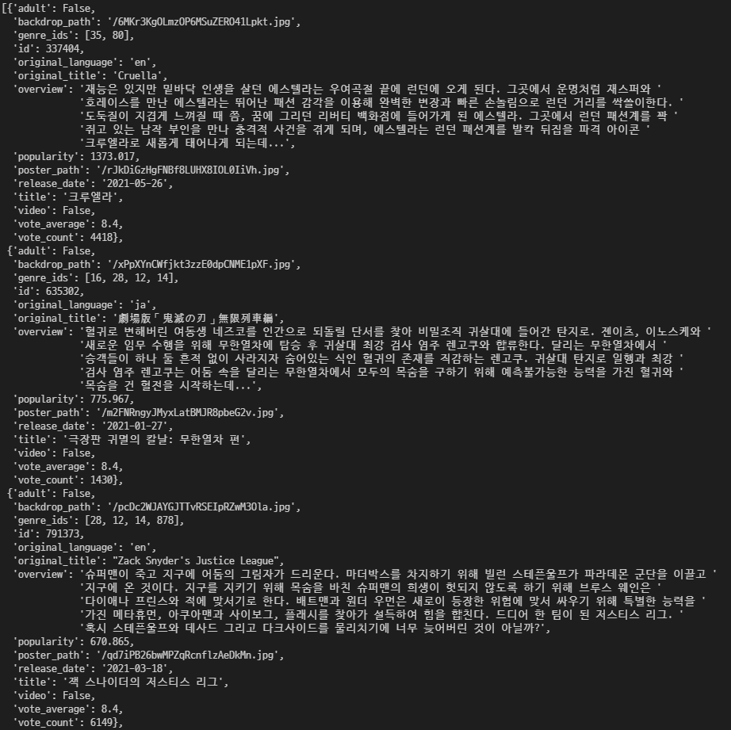
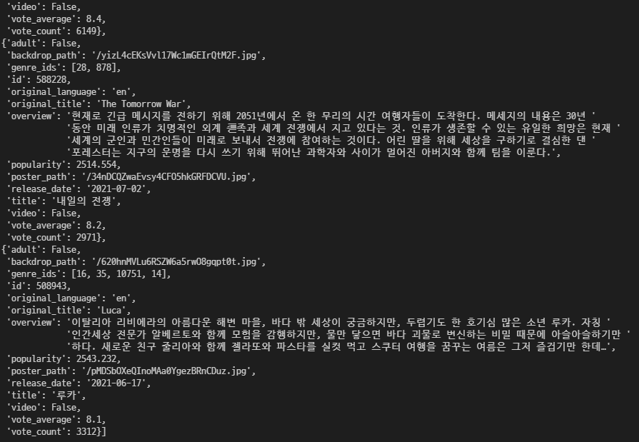
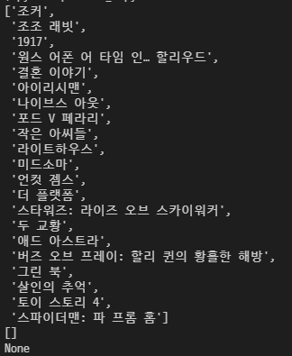
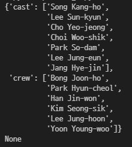

# PJT 02

### 이번 pjt 를 통해 배운 내용

* Python 기본 문법 실습
* 데이터 구조에 대한 분석과 이해
* 요청과 응답에 대한 이해
* API의 활용과 문서 분석


## A. 영화 개수 카운트 기능 구현

* 요구사항 :  

  1.  제공되는 tmdb.py를 이용하여 영화 리스트 조회 URL을 생성합니다.
  2.  requests 패키지를 이용하여 URL에 요청을 보냅니다.

* 결과 : 

  1.  popular를 기준으로 받아온 데이터에서 영화 리스트의 개수를 계산합니다.
  2. 계산한 정보를 반환하는 함수 popular_count를 완성합니다.

  ```python
  import requests
  from tmdb import TMDBHelper
  
  # 본인의 key값 입력
  tmdb_helper = TMDBHelper('45fe12dfc780769c529bfbcba00bf611')
  
  # tmdb.py에 정의돼어있는 함수, 한국에서의 영화정보를 가져오기, 한국어로 표기
  url = tmdb_helper.get_request_url(region='KR', language='ko')
  
  # json 형식으로 url 주소의 데이터 받아오기
  data = requests.get(url).json()
  
  # data에 있는 영화의 갯수를 길이측정으로 카운트
  def popular_count():
  
      return len(data['results'])
  
  if __name__ == '__main__':
      print(popular_count())
  ```

  

  * 문제 접근 방법 및 코드 설명 :  tmdb 사이트에 있는 API 값을 얻어와 데이터를 정리, A 문제의 경우 인기영화 리스트의 정보를 찾아 그 개수를 카운트
  * 이 문제에서 어려웠던점 : tmdb 사이트에 회원가입을 한 후 기본 설정을 하고, 그 후 key 값을 가져오는게 복잡함.
  * 내가 생각하는 이 문제의 포인트 : url에 있는 데이터를 requests 함수를 사용해 가져온 후, 그 데이터를 필요한 정보를 추출하는 것이 중요

  -----

  ## B. 특정 조건에 맞는 영화 출력

* 요구사항 : 

  1.  제공되는 tmdb.py를 이용하여 영화 리스트 조회 URL을 생성합니다.
  2.  requests 패키지를 이용하여 URL에 요청을 보냅니다.

* 결과 : 

  1.  받아온 데이터에서 vote_average를 기준으로 점수가 8 이상인 영화들의 목록을 리스트로 반환하는 함수 vote_average_movies를 완성합니다. 

  ```python
  import requests
  from tmdb import TMDBHelper
  from pprint import pprint
  
  tmdb_helper = TMDBHelper('45fe12dfc780769c529bfbcba00bf611')
  
  url = tmdb_helper.get_request_url(region='KR', language='ko')
  
  data = requests.get(url).json()
  
  def vote_average_movies():
  
      # 영화의 데이터값 얻기
      data_results = data['results']
      over_8_movies = []
  
      for data_result in data_results :
          # 평점이 8점 이상일 때 그 영화의 데이터 가져오기
          if data_result['vote_average'] >= 8 :
              over_8_movies.append(data_result)
  
      return over_8_movies
  
  if __name__ == '__main__':
      pprint(vote_average_movies())
  ```

  

  

  * 문제 접근 방법 및 코드 설명 : url에서 영화의 데이터를 받아와, 평점이 8점 이상인 영화들의 데이터를 가져옴
  * 이 문제에서 어려웠던점 : 평점이 8점 이상인 영화를 찾은 후 영화에 대한 데이터들을 새로 리스트로 정리하는 것이 어려움
  * 내가 생각하는 이 문제의 포인트 : 평점이 8점 이상인 영화들의 딕셔너리 데이터를 리스트로 변환하는 것이 중요

-----

## C. 평점 순 정렬

* 요구사항 : 

  1.  제공되는 tmdb.py를 이용하여 영화 리스트 조회 URL을 생성합니다.
  2.  requests 패키지를 이용하여 URL에 요청을 보냅니다.

* 결과 : 

  1.  받아온 데이터 중 평점이 높은 영화 다섯개의 정보를 리스트로 반환하는 함수 ranking을 완성합니다.

  ```python
  import requests
  from tmdb import TMDBHelper
  from pprint import pprint
  
  tmdb_helper = TMDBHelper('45fe12dfc780769c529bfbcba00bf611')
  
  url = tmdb_helper.get_request_url(region='KR', language='ko')
  
  data = requests.get(url).json()
  
  
  def ranking():
  
      data_results = data['results']
  
      vote_avg_list = []
  
      top5_movie_list = []
  
      # 평점값만 가져옴
      for data_result in data_results :
          vote_avg_list.append(data_result['vote_average'])
      
      # 내림차순으로 정렬
      vote_avg_list.sort(reverse=True)
      
      # 인덱서 5부터 삭제 (1 ~ 5등만 남김)
      del vote_avg_list[5:len(vote_avg_list)]
  
      # 중복되는 숫자 삭제
      vote_avg_list = set(vote_avg_list)
  
      for vote in vote_avg_list :
          for data_result in data_results :
              # 평점이 1 ~ 5등의 평점과 같을 때, 영화 데이터 입력
              if data_result['vote_average'] == vote :
                  top5_movie_list.append(data_result)
  
      return top5_movie_list
  
  if __name__ == '__main__':
      pprint(ranking())
  ```

  

  

  * 문제 접근 방법 및 코드 설명 : 영화의 평점 데이터만 추출해 그 값을 내림차순으로 정렬한 후, 앞선 5개를 제외함. 그 후 중복되는 평점숫자를 하나만 두고 없앤 후 각 평점에 맞는 영화를 순서대로 정리
  * 이 문제에서 어려웠던점 : 평점 데이터만 추출해 정리한 후, 다시 그 평점에 맞는 영화를 찾아 정리하는 것이 어려움
  * 내가 생각하는 이 문제의 포인트 : 평점이 1~5등인 영화들을 순서대로 찾는 것이 중요

-----

## D. 제목 검색, 영화 추천

* 요구사항 : 

  1.  제공되는 tmdb.py를 이용하여 영화 제목을 기준으로 TMDB에서 사용하는 id를 검색합니다.
  2.  id를 기준으로 추천영화 목록 조회 URL을 생성합니다.
  3.  requests 패키지를 이용하여 URL에 요청을 보냅니다.

* 결과 : 

  1.  TMDB에서 추천받은 영화 리스트에서 제목을 리스트에 저장합니다.
  2.  저장된 리스트를 반환하는 함수 recommendation을 완성합니다.
  3.  올바르지 않은 영화 제목으로 id가 없는 경우 None를 반환합니다.
  4.  id값은 있지만 추천영화가 없는 경우 빈 리스트를 반환합니다.

  ```python
  import requests
  from tmdb import TMDBHelper
  from pprint import pprint
  
  tmdb_helper = TMDBHelper('45fe12dfc780769c529bfbcba00bf611')
  
  url = tmdb_helper.get_request_url(region='KR', language='ko')
  
  data = requests.get(url).json()
  
  rec_movies_title = []
  
  # 입력한 영화의 id 값 얻어오기
  def recommendation(title):
      movie_id = tmdb_helper.get_movie_id(title)
  
      # 영화 id 값에 맞는 주소 정의
      url2 = f'https://api.themoviedb.org/3/movie/{movie_id}/recommendations?api_key=45fe12dfc780769c529bfbcba00bf611&language=ko'
  
      data2 = requests.get(url2).json()
  
      # 존재하는 영화를 입력했지만 추천영화가 없을 때
      if  data2.get('total_results') == 0 :
          return []
      # 존재하지 않는 영화를 입력했을 때
      elif    data2.get('success') == False :
          return None
      else :
      # 추천영화가 있을 때
          for data2_title in data2['results'] :
              rec_movies_title.append(data2_title['title'])
          return rec_movies_title
  
  if __name__ == '__main__':
      pprint(recommendation('기생충'))
      pprint(recommendation('그래비티'))
      pprint(recommendation('검색할 수 없는 영화'))
  ```

  

  * 문제 접근 방법 및 코드 설명 : 입력한 영화의 id 값을 찾아 그 id를 recommendation에 맞는 url의 주소칸에 입력한 후, 3가지 경우로 나눠 값을 반환.
    1)  존재하는 영화를 입력했지만 추천영화가 없을 때 : [] 반환
    2)  존재하지 않는 영화를 입력했을 때 : None 반환
    3)  추천영화가 있을 때 : 추천영화의 제목만 추출해 리스트로 정리한 후 반환
  * 이 문제에서 어려웠던점 : tmdb.py에 recommendation 주소를 정의하는 함수가 없어 직접 url을 작성하는 것, 각 경우에 맞는 반환값을 지정하는 것이 어려움
  * 내가 생각하는 이 문제의 포인트 : url 지정방법을 아는 것, .get 함수를 사용할 줄 아는 것이 중요

-----

## E. 배우, 제작진 리스트 출력

* 요구사항 : 

  1.  제공되는 tmdb.py를 이용하여 영화 제목을 기준으로 TMDB에서 사용하는 id를 검색합니다.
  2.  id를 기준으로 배우와 제작진 목록 조회 URL을 생성합니다.
  3.  requests 패키지를 이용하여 URL에 요청을 보냅니다.

* 결과 : 

  1.  cast_id 값이 10보다 작은 배우의 이름을 리스트에 저장합니다.
  2. department 값이 Directing인 감독의 이름을 리스트에 저장합니다.
  3. 반환되는 딕셔너리는 cast, crew 두개의 key를 가지고 각각 배우 리스트와 제작진 리스트를 value로 갖습니다.

  ```python
  import requests
  from tmdb import TMDBHelper
  from pprint import pprint
  
  tmdb_helper = TMDBHelper('45fe12dfc780769c529bfbcba00bf611')
  
  url = tmdb_helper.get_request_url(region='KR', language='ko')
  
  data = requests.get(url).json()
  
  rec_movies_title = []
  
  # 입력한 영화의 id 값 얻어오기
  def recommendation(title):
      movie_id = tmdb_helper.get_movie_id(title)
  
      # 영화 id 값에 맞는 주소 정의
      url2 = f'https://api.themoviedb.org/3/movie/{movie_id}/recommendations?api_key=45fe12dfc780769c529bfbcba00bf611&language=ko'
  
      data2 = requests.get(url2).json()
  
      # 존재하는 영화를 입력했지만 추천영화가 없을 때
      if  data2.get('total_results') == 0 :
          return []
      # 존재하지 않는 영화를 입력했을 때
      elif    data2.get('success') == False :
          return None
      else :
      # 추천영화가 있을 때
          for data2_title in data2['results'] :
              rec_movies_title.append(data2_title['title'])
          return rec_movies_title
  
  if __name__ == '__main__':
      pprint(recommendation('기생충'))
      pprint(recommendation('그래비티'))
      pprint(recommendation('검색할 수 없는 영화'))
  ```

  

  * 문제 접근 방법 및 코드 설명 : 입력한 영화의 id값을 찾아 그에 맞는 영화의 credit 정보를 찾은 후, cast_id가 10보다 작은 casts, 그리고 department가 Directing인 crews의 리스트를 따로 저장한다. 그 후 새로운 딕셔너리를 만들어 각 key에 맞는 value를 입력
  * 이 문제에서 어려웠던점 : 입력한 영화의 id값을 찾아 credit을 찾는 url을 새로 만드는 것, 조건에 맞는 정보를 추출해 리스트로 만든 후, 그 값을 다시 딕셔너리 값으로 정리하는 것이 어려움
  * 내가 생각하는 이 문제의 포인트 : credit 정보를 찾아오는 url을 만들 줄 아는 것, 얻은 데이터를 조건에 맞게 추출한 후 그 값을 리스트로, 리스트들을 딕셔너리로 만드는 것이 중요

# 후기

* 딕셔너리는 슬슬 익숙해지는 것 같다. 딕셔너리와 리스트가 복잡하게 사용될 때, for문을 이용해 껍질을 벗기고 얻는 데이터의 값과 type을 print해서 천천히 데이터를 분석하고 추출하는 과정이 몸에 익기 시작했다.
* 저번 pjt01과는 다르게 인터넷 데이터를 가져와 사용하는 과정이 현실감이 느껴지고 진짜 현직에서 일하는 기분이 들어서 좋았다.
* 계속 쓰지않는 함수는 까먹게 돼서 필요할 때 마다 찾아쓰게 된다.
*  B문제에서 딕셔너리와 리스트의 껍질을 벗기는 과정에서 혼란이 와서 한동안 헤맸고, 이 과정에서 살짝의 깨달음을 얻은 것 같다.