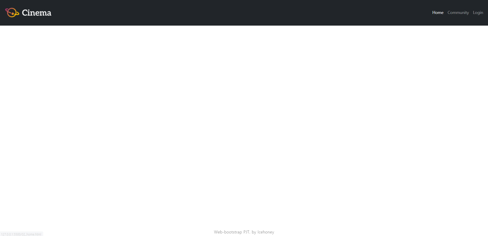
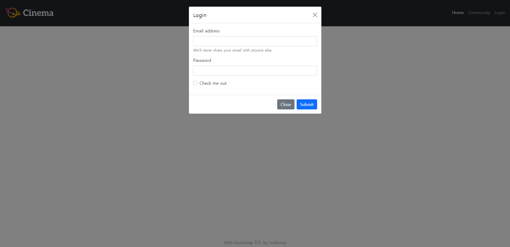
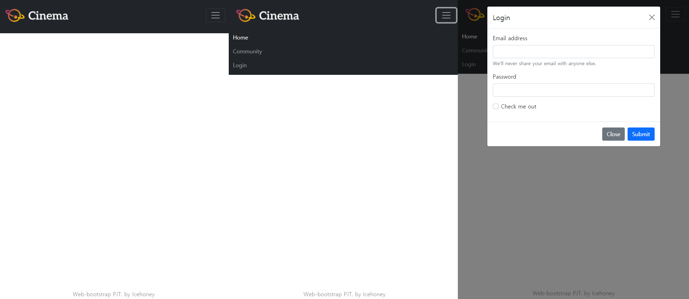
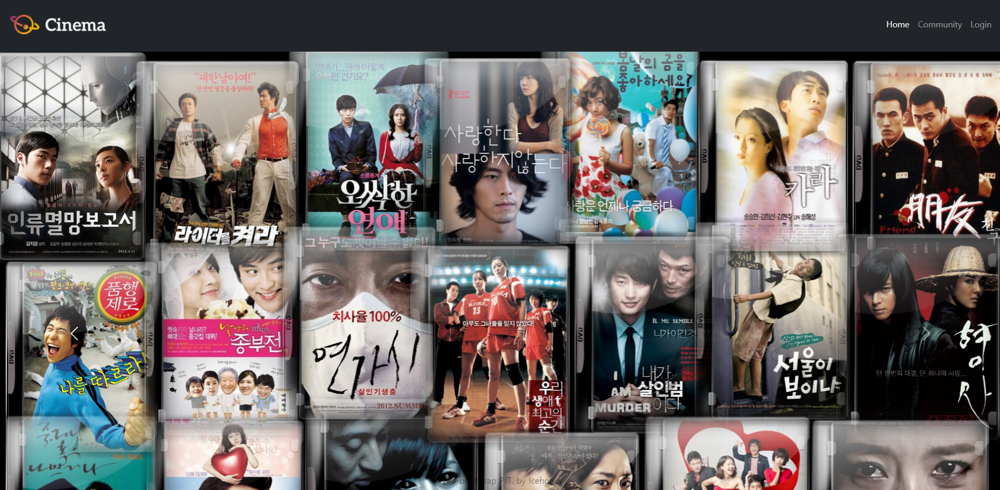
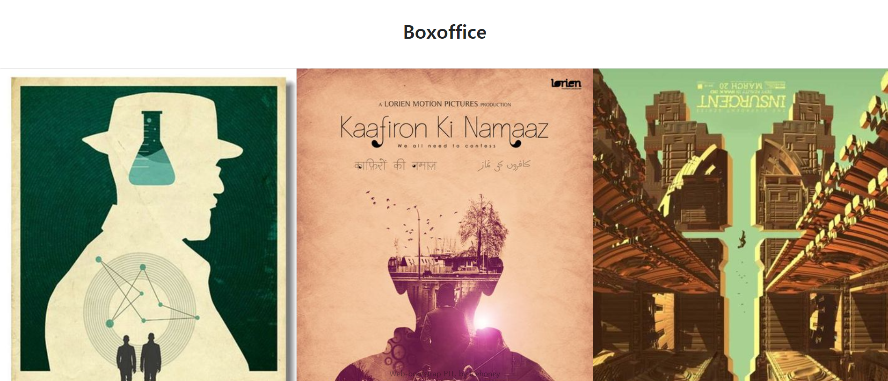
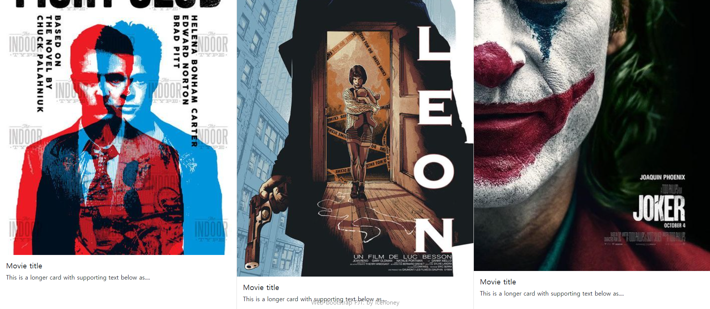
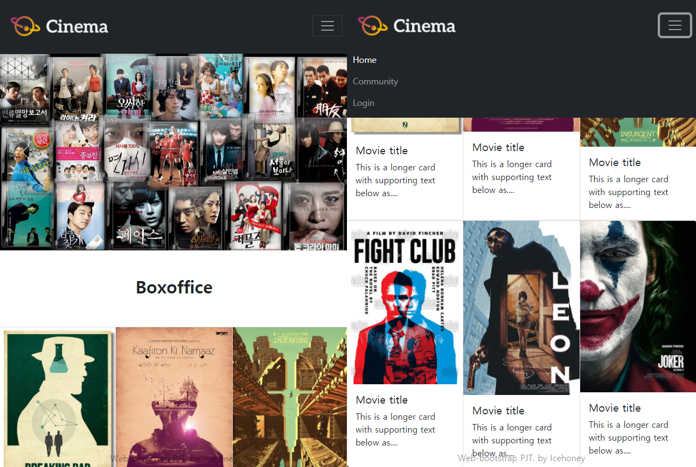
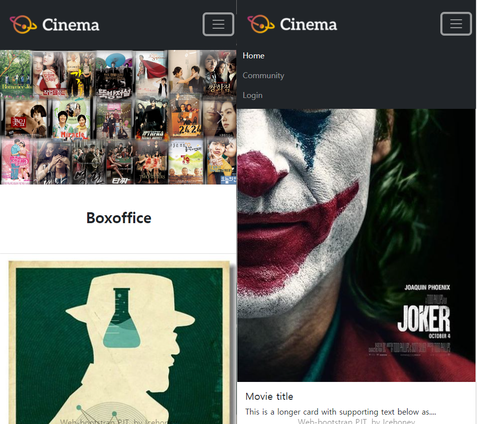
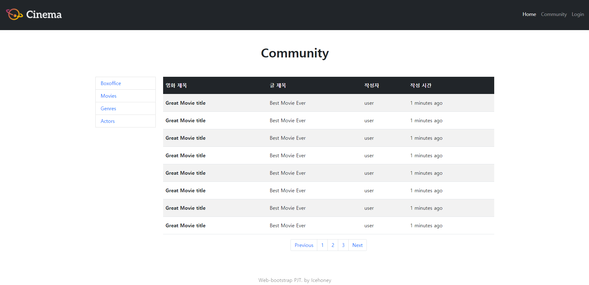
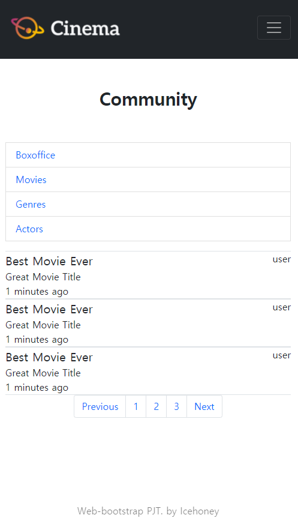

# PJT 03

### 이번 pjt 를 통해 배운 내용

* HTML을 통한 웹 페이지 마크업 분석
* CSS 라이브러리의 이해와 활용
* 컴포넌트 및 그리스 시스템 활용
* 커뮤니티 서비스 반응형 레이아웃 구성


## A. 01_nav_footer

* 요구사항 :  

  i. 네비게이션 바(Navigation Bar)

  1.   네비게이션 바는 스크롤을 하더라도 항상 상단에 고정되어 있습니다.
  2.   로고 이미지는 images 폴더 안의 logo.png파일을 사용합니다.
  3.   로고 이미지는 클릭이 가능한 링크이며, 해당 페이지(02_home.html)로 이동해야 합니다.
  4.   네비게이션 바 내부의 네비게이션 리스트(Home, Community, Login)는 ul 과 li 요소를 사용합니다.
  5.   네비게이션 바 내부의 네비게이션 리스트(Home, Community, Login)는 오른쪽에 배치합니다.
  6.   네비게이션 리스트의 각 항목들은 클릭이 가능한 링크이며, 해당 페이지 (02_home.html, 03_community.html, #)로 이동해야 합니다.
  7.   Viewport의 가로 크기가 768px 미만일 경우에는 네비게이션 리스트(Home, Community, Login)가 햄버거 버튼으로 교체되며, 클릭했을 시 세부 항목을 볼 수 있습니다. 
  8.   네비게이션 리스트(Home, Community, Login)의 항목들 중에서 Home을 강조합 니다. 
  9.   네비게이션 리스트의 Login 항목은 클릭 시 요소가 Modal 컴포넌트를 통하여 나타납니다. (페이지 이동이 일어나지 않습니다.) 
  10.   Modal 컴포넌트 내부에는 form요소를 배치합니다.
  11.   Modal 컴포넌트에서 form요소 내부의 비밀번호는 표시되지 않습니다.

  ii. 푸터(Footer)

  1.  푸터는 스크롤을 하더라도 항상 하단에 고정되어 있습니다. 
  2.  푸터에 작성된 내용은 수평으로 정렬되어 있습니다. (왼쪽, 오른쪽 여백이 같습니 다.) 
  3.  푸터에 작성된 내용의 빈 부분(`_____`)은 본인의 이름을 작성합니다.
  4.  위에 명시된 내용 이외에는 자유롭게 작성합니다.

* 결과 : 

  ```python
  <!DOCTYPE html>
  <html lang="ko">
  <head>
    <meta charset="UTF-8">
    <meta name="viewport" content="width=device-width, initial-scale=1.0">
  
    <!-- Bootstrap CSS -->
    <link href="https://cdn.jsdelivr.net/npm/bootstrap@5.1.0/dist/css/bootstrap.min.css" rel="stylesheet" integrity="sha384-KyZXEAg3QhqLMpG8r+8fhAXLRk2vvoC2f3B09zVXn8CA5QIVfZOJ3BCsw2P0p/We" crossorigin="anonymous">
    <!-- Custom CSS -->
    <link rel="stylesheet" href="01_nav_footer.css">
  
    <title>Navbar Footer Test</title>
  </head>
  
  <body>
    <!-- 01_nav_footer.html -->
    <!-- Navbar 만들기(상단에 고정) -->
    <nav class="sticky-top navbar navbar-expand-md navbar-dark bg-dark">
      <div class="container-fluid">
        <a class="navbar-brand" href="02_home.html">
          
        </a>
        <!-- 햄버거 메뉴가 나오게 하는 코드 -->
        <button class="navbar-toggler" type="button" data-bs-toggle="collapse" data-bs-target="#navbarNavAltMarkup" aria-controls="navbarNavAltMarkup" aria-expanded="false" aria-label="Toggle navigation">
          <span class="navbar-toggler-icon"></span>
        </button>
        <div class="collapse navbar-collapse justify-content-end" id="navbarNavAltMarkup">
          <ul class="navbar-nav">
            <li class="nav-link active" aria-current="page">
              <a href="02_home.html" class="text-white text-decoration-none">Home</a>
            </li>
            <li class="nav-link">
              <a href="03_community.html" class="text-white-50 text-decoration-none">Community</a>
            </li>
            <!-- Login 부분은 modal 사용 -->
            <li class="nav-link" data-bs-toggle="modal" data-bs-target="#staticBackdrop">
              <a href="#" class="text-white-50 text-decoration-none">Login</a>
            </li>
          </div>
        </div>
      </nav>
  <!-- Modal -->
    <div class="modal fade" id="staticBackdrop" data-bs-backdrop="static" data-bs-keyboard="false" tabindex="-1" aria-labelledby="staticBackdropLabel" aria-hidden="true">
      <div class="modal-dialog">
        <div class="modal-content">
          <div class="modal-header">
            <h5 class="modal-title" id="staticBackdropLabel">Login</h5>
            <button type="button" class="btn-close" data-bs-dismiss="modal" aria-label="Close"></button>
          </div>
          <div class="modal-body">
            <form>
              <div class="mb-3">
                <label for="exampleInputEmail1" class="form-label">Email address</label>
                <input type="email" class="form-control" id="exampleInputEmail1" aria-describedby="emailHelp">
                <div id="emailHelp" class="form-text">We'll never share your email with anyone else.</div>
              </div>
              <div class="mb-3">
                <label for="exampleInputPassword1" class="form-label">Password</label>
                <input type="password" class="form-control" id="exampleInputPassword1">
              </div>
              <div class="mb-3 form-check">
                <input type="checkbox" class="form-check-input" id="exampleCheck1">
                <label class="form-check-label" for="exampleCheck1">Check me out</label>
              </div>
            </form>
          </div>
          <div class="modal-footer">
            <button type="button" class="btn btn-secondary" data-bs-dismiss="modal">Close</button>
            <input class="btn btn-primary" type="submit" value="Submit">
          </div>
        </div>
      </div>
    </div>
  
    <!-- 하단에 고정된 텍스트 -->
    <footer class="fixed-bottom text-black-50 text-center pb-2">
      Web-bootstrap PJT. by Icehoney
    </footer>
  
    <!-- Bootstrap JS -->
    <script src="https://cdn.jsdelivr.net/npm/bootstrap@5.1.0/dist/js/bootstrap.bundle.min.js" integrity="sha384-U1DAWAznBHeqEIlVSCgzq+c9gqGAJn5c/t99JyeKa9xxaYpSvHU5awsuZVVFIhvj" crossorigin="anonymous"></script>
  </body>
  </html>
  ```

  

  

  

  * 문제 접근 방법 및 코드 설명 :  Navbar(image 삽입, 최상단에 위치(sticky)), , modal(여기에 Forms 삽입), bottom fix를 할 줄 알아야한다.
  * 이 문제에서 어려웠던점 : Navbar의 Login을 modal을 삽입하고, 그 Forms를 다시 수정하는 작업이 어려움
  * 내가 생각하는 이 문제의 포인트 : Navbar의 Login을 modal을 삽입하고, 그 Forms를 다시 수정하는 작업이 중요함

  -----

  ## B. 02_home

* 요구사항 : 

  i. 네비게이션 바(Navigation Bar)

  1.   네비게이션 리스트(Home, Community, Login)의 항목들 중에서 Home을 강조합 니다. 
  2.   Home 페이지는 크게 상단 Header와 하단 Section요소로 이루어져 있습니다

  ii. Header

  1. Header는 Carousel 컴포넌트로 구성합니다. 이미지는 최소 3장이며, 자동으로 전환됩니다. (images/ 폴더 안의 header 이미지들을 사용합니다.)

  iii. Section

  1.  Section 내부의 개별 요소(article)들은 이미지, 제목, 설명을 포함하는 Card 컴포 넌트로 구성합니다. (이미지는 images/ 폴더 안의 movie 이미지들을 사용합니다.) 
  2.  각 요소들은 좌우 일정한 간격으로 떨어져 있습니다. (간격은 자유롭게 설정 가 능합니다.) 세로 간격은 일정하지 않아도 됩니다. 
  3.  Section 내부의 요소(article)들은 Viewport의 가로 크기가 576px미만일 경우에는 한 열(row)에 1개씩 표시됩니다. 
  4.  Section 내부의 요소(article)들은 Viewport의 가로 크기가 576px이상일 경우에는 한 열(row)에 2개 이상 자유롭게 표시합니다. 
  5.  위에 명시된 내용 이외에는 자유롭게 작성합니다.

* 결과 : 

  ```python
  <!DOCTYPE html>
  <html lang="ko">
  <head>
    <meta charset="UTF-8">
    <meta name="viewport" content="width=device-width, initial-scale=1.0">
    
    <!-- Bootstrap CSS -->
    <link href="https://cdn.jsdelivr.net/npm/bootstrap@5.1.0/dist/css/bootstrap.min.css" rel="stylesheet" integrity="sha384-KyZXEAg3QhqLMpG8r+8fhAXLRk2vvoC2f3B09zVXn8CA5QIVfZOJ3BCsw2P0p/We" crossorigin="anonymous">
    <!-- Custom CSS -->
    <link rel="stylesheet" href="01_nav_footer.css">
    <link rel="stylesheet" href="02_home.css">
    
    <title>Home</title>
  </head>
  <body>
    <!-- 01_nav_footer 에서 완성한 Navigation bar 코드를 붙여넣어 주세요. -->
    <!-- Navbar 만들기(상단에 고정) -->
    <nav class="sticky-top navbar navbar-expand-md navbar-dark bg-dark">
      <div class="container-fluid">
        <a class="navbar-brand" href="02_home.html">
          
        </a>
        <!-- 햄버거 메뉴가 나오게 하는 코드 -->
        <button class="navbar-toggler" type="button" data-bs-toggle="collapse" data-bs-target="#navbarNavAltMarkup" aria-controls="navbarNavAltMarkup" aria-expanded="false" aria-label="Toggle navigation">
          <span class="navbar-toggler-icon"></span>
        </button>
        <div class="collapse navbar-collapse justify-content-end" id="navbarNavAltMarkup">
          <ul class="navbar-nav">
            <li class="nav-link active" aria-current="page">
              <a href="02_home.html" class="text-white text-decoration-none">Home</a>
            </li>
            <li class="nav-link">
              <a href="03_community.html" class="text-white-50 text-decoration-none">Community</a>
            </li>
            <!-- Login 부분은 modal 사용 -->
            <li class="nav-link" data-bs-toggle="modal" data-bs-target="#staticBackdrop">
              <a href="#" class="text-white-50 text-decoration-none">Login</a>
            </li>
          </div>
        </div>
      </nav>
  <!-- Modal -->
    <div class="modal fade" id="staticBackdrop" data-bs-backdrop="static" data-bs-keyboard="false" tabindex="-1" aria-labelledby="staticBackdropLabel" aria-hidden="true">
      <div class="modal-dialog">
        <div class="modal-content">
          <div class="modal-header">
            <h5 class="modal-title" id="staticBackdropLabel">Login</h5>
            <button type="button" class="btn-close" data-bs-dismiss="modal" aria-label="Close"></button>
          </div>
          <div class="modal-body">
            <form>
              <div class="mb-3">
                <label for="exampleInputEmail1" class="form-label">Email address</label>
                <input type="email" class="form-control" id="exampleInputEmail1" aria-describedby="emailHelp">
                <div id="emailHelp" class="form-text">We'll never share your email with anyone else.</div>
              </div>
              <div class="mb-3">
                <label for="exampleInputPassword1" class="form-label">Password</label>
                <input type="password" class="form-control" id="exampleInputPassword1">
              </div>
              <div class="mb-3 form-check">
                <input type="checkbox" class="form-check-input" id="exampleCheck1">
                <label class="form-check-label" for="exampleCheck1">Check me out</label>
              </div>
            </form>
          </div>
          <div class="modal-footer">
            <button type="button" class="btn btn-secondary" data-bs-dismiss="modal">Close</button>
            <input class="btn btn-primary" type="submit" value="Submit">
          </div>
        </div>
      </div>
    </div>
  
    <!-- 02_home.html -->
    <header>
      <!-- Carousel을 사용해서 사진 3개를 자동으로 전환 -->
      <div id="carouselExampleControls" class="carousel slide" data-bs-ride="carousel">
        <div class="carousel-inner">
          <div class="carousel-item active">
            
          </div>
          <div class="carousel-item">
            
          </div>
          <div class="carousel-item">
            
          </div>
        </div>
        <button class="carousel-control-prev" type="button" data-bs-target="#carouselExampleControls" data-bs-slide="prev">
          <span class="carousel-control-prev-icon" aria-hidden="true"></span>
          <span class="visually-hidden">Previous</span>
        </button>
        <button class="carousel-control-next" type="button" data-bs-target="#carouselExampleControls" data-bs-slide="next">
          <span class="carousel-control-next-icon" aria-hidden="true"></span>
          <span class="visually-hidden">Next</span>
        </button>
      </div>
    </header>
  
      <!-- 텍스트 입력 후 중앙배치 -->
    <h1 class="text-center py-5 fw-bold">Boxoffice</h1>
  
    <section>
      <!-- 카드 그룹으로 6개의 이미지 나열(3개씩 2열, 576px 이하로 1개로 바뀜) -->
      <div class="card-group">
        <article class="card">
          
          <div class="card-body">
            <h5 class="card-title">Movie title</h5>
            <p class="card-text">This is a longer card with supporting text below as....</p>
          </div>
        </article>
        <article class="card">
          
          <div class="card-body">
            <h5 class="card-title">Movie title</h5>
            <p class="card-text">This is a longer card with supporting text below as....</p>
          </div>
        </article>
        <article class="card">
          
          <div class="card-body">
            <h5 class="card-title">Movie title</h5>
            <p class="card-text">This is a longer card with supporting text below as....</p>
          </div>
        </article>
      </div>
      <div class="card-group">
        <article class="card">
          
          <div class="card-body">
            <h5 class="card-title">Movie title</h5>
            <p class="card-text">This is a longer card with supporting text below as....</p>
          </div>
        </article>
        <article class="card">
          
          <div class="card-body">
            <h5 class="card-title">Movie title</h5>
            <p class="card-text">This is a longer card with supporting text below as....</p>
          </div>
        </article>
        <article class="card">
          
          <div class="card-body">
            <h5 class="card-title">Movie title</h5>
            <p class="card-text">This is a longer card with supporting text below as....</p>
          </div>
        </article>
      </div>
    </section>
  
    <!-- 01_nav_footer.html -->
    <!-- 01_nav_footer 에서 완성한 Footer 코드를 붙여넣어 주세요. -->
    <!-- 하단에 고정된 텍스트 -->
    <footer class="fixed-bottom text-black-50 text-center pb-2">
      Web-bootstrap PJT. by Icehoney
    </footer>
  
    <!-- Bootstrap JS -->
    <script src="https://cdn.jsdelivr.net/npm/bootstrap@5.1.0/dist/js/bootstrap.bundle.min.js" integrity="sha384-U1DAWAznBHeqEIlVSCgzq+c9gqGAJn5c/t99JyeKa9xxaYpSvHU5awsuZVVFIhvj" crossorigin="anonymous"></script>  
  </body>
  </html>
  ```

  

  

  

  

  

  * 문제 접근 방법 및 코드 설명 : 사진을 양식에 맞게 삽입하기, Carousel 컴포넌트, Card 컴포넌트을 사용해야한다.
  * 이 문제에서 어려웠던점 : Card 컴포넌트의 설명글을 양식에 맞추는 것이 어려움
  * 내가 생각하는 이 문제의 포인트 : Carousel, Card 컴포넌트의 양식을 찾아 조건에 맞게 사진을 삽입하고 텍스트를 이쁘게 정리하는 것이 중요

-----

## C. 03_community

* 요구사항 : 

  i. 네비게이션 바(Navigation Bar)

  1.   네비게이션 리스트(Home, Community, Login)의 항목들 중에서 Community를 강조합니다.
  2.   Community 페이지는 크게 게시판 목록, 게시판으로 이루어져 있습니다. 
  3.   게시판 목록과 게시판은 div.main 요소로 둘러쌓여 있습니다.

  ii. 게시판 목록

  1.  게시판 목록은 aside 요소로 이루어져 있습니다. 
  2.  게시판 목록 내부의 각 항목들(Boxoffice, Movies, Genres, Actors)은 List group 컴포넌트를 활용합니다. 
  3.  게시판 목록 내부의 각 항목들은 클릭이 가능한 링크이며, 모두 동작은 하지 않습니다. 
  4.  Viewport의 가로 크기가 992px 이상일 경우에는 게시판 목록 내부의 항 목들(Boxoffice, Movies, Genres, Actors)은 div.main영역의 내부에서 좌측 1/6 만큼의 너비를 가집니다.
  5.  Viewport의 가로 크기가 992px 미만일 경우에는 게시판 목록 내부의 항 목들(Boxoffice, Movies, Genres, Actors)은 div.main영역의 내부에서 전체만 큼의 너비를 가집니다.

  iii. 게시판

  1.  게시판은 Viewport의 가로크기에 따라 전혀 다른 요소를 표시합니다. 
  2.  Viewport의 가로 크기가 992px 이상일 경우에는 게시글들이 표(table)요 소로 표시되며, div.main영역의 내부에서 우측 5/6 만큼의 너비를 가집니 다.
  3.  Viewport의 가로 크기가 992px 미만일 경우에는 게시글들이 글(article)요 소들의 집합으로 표시되고 가로선으로 구분합니다(스타일링은 자유롭게 진행합니다). div.main영역의 내부에서 전체만큼의 너비를 가집니다. 
  4.  게시글은 글 제목, 영화 제목, 사용자 id, 작성시간으로 구성되어 있으며 해당 구성을 유지해야 합니다. 
  5.  테스트 게시글의 개수는 2개 이상으로 자유롭게 구성할 수 있습니다. 
  6.  게시판 탐색기(paginator)는 게시판 아래에 위치하며, 게시판과 같은 가로 폭을 가집니다. 
  7.  게시판 탐색기(paginator)는 자신의 영역 안에서 좌우 중앙 정렬되어 있 습니다. 
  8.  게시판 탐색기(paginator) 내부의 요소들은 클릭이 가능한 링크이며, 모두 동작은 하지 않습니다. 
  9.  위에 명시된 내용 이외에는 자유롭게 작성합니다.

* 결과 : 

  ```python
  <!DOCTYPE html>
  <html lang="ko">
  <head>
    <meta charset="UTF-8">
    <meta name="viewport" content="width=device-width, initial-scale=1.0">
    
    <!-- Bootstrap CSS -->
    <link href="https://cdn.jsdelivr.net/npm/bootstrap@5.1.0/dist/css/bootstrap.min.css" rel="stylesheet" integrity="sha384-KyZXEAg3QhqLMpG8r+8fhAXLRk2vvoC2f3B09zVXn8CA5QIVfZOJ3BCsw2P0p/We" crossorigin="anonymous">
    <!-- Custom CSS -->
    <link rel="stylesheet" href="01_nav_footer.css">
    <link rel="stylesheet" href="03_community.css">
  
    <title>Community</title>
  </head>
  <body>
  
    <!-- 01_nav_footer 에서 완성한 Navigation bar 코드를 붙여넣어 주세요. -->
    <!-- Navbar 만들기(상단에 고정) -->
    <nav class="sticky-top navbar navbar-expand-md navbar-dark bg-dark">
      <div class="container-fluid">
        <a class="navbar-brand" href="02_home.html">
          
        </a>
        <!-- 햄버거 메뉴가 나오게 하는 코드 -->
        <button class="navbar-toggler" type="button" data-bs-toggle="collapse" data-bs-target="#navbarNavAltMarkup" aria-controls="navbarNavAltMarkup" aria-expanded="false" aria-label="Toggle navigation">
          <span class="navbar-toggler-icon"></span>
        </button>
        <div class="collapse navbar-collapse justify-content-end" id="navbarNavAltMarkup">
          <ul class="navbar-nav">
            <li class="nav-link active" aria-current="page">
              <a href="02_home.html" class="text-white text-decoration-none">Home</a>
            </li>
            <li class="nav-link">
              <a href="03_community.html" class="text-white-50 text-decoration-none">Community</a>
            </li>
            <!-- Login 부분은 modal 사용 -->
            <li class="nav-link" data-bs-toggle="modal" data-bs-target="#staticBackdrop">
              <a href="#" class="text-white-50 text-decoration-none">Login</a>
            </li>
          </div>
        </div>
      </nav>
  <!-- Modal -->
    <div class="modal fade" id="staticBackdrop" data-bs-backdrop="static" data-bs-keyboard="false" tabindex="-1" aria-labelledby="staticBackdropLabel" aria-hidden="true">
      <div class="modal-dialog">
        <div class="modal-content">
          <div class="modal-header">
            <h5 class="modal-title" id="staticBackdropLabel">Login</h5>
            <button type="button" class="btn-close" data-bs-dismiss="modal" aria-label="Close"></button>
          </div>
          <div class="modal-body">
            <form>
              <div class="mb-3">
                <label for="exampleInputEmail1" class="form-label">Email address</label>
                <input type="email" class="form-control" id="exampleInputEmail1" aria-describedby="emailHelp">
                <div id="emailHelp" class="form-text">We'll never share your email with anyone else.</div>
              </div>
              <div class="mb-3">
                <label for="exampleInputPassword1" class="form-label">Password</label>
                <input type="password" class="form-control" id="exampleInputPassword1">
              </div>
              <div class="mb-3 form-check">
                <input type="checkbox" class="form-check-input" id="exampleCheck1">
                <label class="form-check-label" for="exampleCheck1">Check me out</label>
              </div>
            </form>
          </div>
          <div class="modal-footer">
            <button type="button" class="btn btn-secondary" data-bs-dismiss="modal">Close</button>
            <input class="btn btn-primary" type="submit" value="Submit">
          </div>
        </div>
      </div>
    </div>
  
    <!-- 03_community.html -->
  
      <!-- Board -->
      <!-- 상단에 텍스트 입력 후 중앙배치 -->
    <h1 class="text-center fw-bold py-5">Community</h1>
  
    <div class="main container">
      <div class="row">
      <!-- Sidebar -->
        <!-- 사이드바 - lg 이상일 때 col-2, 미만일 때 col-12로 열을 다 먹음 -->
        <aside class="col-12 col-lg-2">
          <ul class="p-0">
            <li class="list-group-item">
              <a href="" class="text-decoration-none">Boxoffice</a>
            </li>
            <li class="list-group-item">
              <a href="" class="text-decoration-none">Movies</a>
            </li>
            <li class="list-group-item">
              <a href="" class="text-decoration-none">Genres</a>
            </li>
            <li class="list-group-item">
              <a href="" class="text-decoration-none">Actors</a>
            </li>
          </ul>
        </aside>
         <!-- Board -->
         <!-- 보드 메뉴판 - lg 이상일 때 col-10, 미만일 때 사라짐 -->
        <section class="d-none d-lg-block col-lg-10">
          <div>
            <table>
              <!-- 교차로 누런 색이 들어가는 테이블 -->
              <table class="table table-striped">
                <thead>
                  <tr>
                    <th scope="col" class="bg-dark text-white py-3">영화 제목</th>
                    <th scope="col" class="bg-dark text-white py-3">글 제목</th>
                    <th scope="col" class="bg-dark text-white py-3">작성자</th>
                    <th scope="col" class="bg-dark text-white py-3">작성 시간</th>
                  </tr>
                </thead>
                <tbody>
                  <tr>
                    <th class="py-3">Great Movie title</th>
                    <td class="py-3">Best Movie Ever</td>
                    <td class="py-3">user</td>
                    <td class="py-3">1 minutes ago</td>
                  </tr>
                  <tr>
                    <th class="py-3">Great Movie title</th>
                    <td class="py-3">Best Movie Ever</td>
                    <td class="py-3">user</td>
                    <td class="py-3">1 minutes ago</td>
                  </tr>
                  <tr>
                    <th class="py-3">Great Movie title</th>
                    <td class="py-3">Best Movie Ever</td>
                    <td class="py-3">user</td>
                    <td class="py-3">1 minutes ago</td>
                  </tr>
                  <tr>
                    <th class="py-3">Great Movie title</th>
                    <td class="py-3">Best Movie Ever</td>
                    <td class="py-3">user</td>
                    <td class="py-3">1 minutes ago</td>
                  </tr>
                  <tr>
                    <th class="py-3">Great Movie title</th>
                    <td class="py-3">Best Movie Ever</td>
                    <td class="py-3">user</td>
                    <td class="py-3">1 minutes ago</td>
                  </tr>
                  <tr>
                    <th class="py-3">Great Movie title</th>
                    <td class="py-3">Best Movie Ever</td>
                    <td class="py-3">user</td>
                    <td class="py-3">1 minutes ago</td>
                  </tr>
                  <tr>
                    <th class="py-3">Great Movie title</th>
                    <td class="py-3">Best Movie Ever</td>
                    <td class="py-3">user</td>
                    <td class="py-3">1 minutes ago</td>
                  </tr>
                  <tr>
                    <th class="py-3">Great Movie title</th>
                    <td class="py-3">Best Movie Ever</td>
                    <td class="py-3">user</td>
                    <td class="py-3">1 minutes ago</td>
                  </tr>
                </tbody>
              </table>
            </table>
          </div>
  
          <article>
            <!-- 게시판 탐색기(paginator) 사용 -->
            <nav aria-label="Page navigation example">
              <ul class="pagination justify-content-center">
                <li class="page-item"><a class="page-link" href="#">Previous</a></li>
                <li class="page-item"><a class="page-link" href="#">1</a></li>
                <li class="page-item"><a class="page-link" href="#">2</a></li>
                <li class="page-item"><a class="page-link" href="#">3</a></li>
                <li class="page-item"><a class="page-link" href="#">Next</a></li>
              </ul>
            </nav>
          </article>
        </section>
  
        <!-- lg 이상일 때 사라지고, lg 미만일 때 보이는 텍스트 생성 -->
        <section class="d-flex flex-column d-block d-md-block d-lg-none">
          <div class="border border-start-0 border-end-0">
            <div class="d-flex justify-content-between">
              <div class="fs-5">Best Movie Ever</div>
              <div>user</div>
            </div>
            <div>Great Movie Title</div>
            <div>1 minutes ago</div>
        </div>
        <div class="border border-start-0 border-end-0">
          <div class="d-flex justify-content-between">
            <div class="fs-5">Best Movie Ever</div>
            <div>user</div>
          </div>
          <div>Great Movie Title</div>
          <div>1 minutes ago</div>
        </div>
        <div class="border border-start-0 border-end-0">
          <div class="d-flex justify-content-between">
            <div class="fs-5">Best Movie Ever</div>
            <div>user</div>
          </div>
          <div>Great Movie Title</div>
          <div>1 minutes ago</div>
        </div>
          <article>
            <nav aria-label="Page navigation example">
              <ul class="pagination justify-content-center">
                <li class="page-item"><a class="page-link" href="#">Previous</a></li>
                <li class="page-item"><a class="page-link" href="#">1</a></li>
                <li class="page-item"><a class="page-link" href="#">2</a></li>
                <li class="page-item"><a class="page-link" href="#">3</a></li>
                <li class="page-item"><a class="page-link" href="#">Next</a></li>
              </ul>
            </nav>
          </article>
        </section>
      </div>
    </div>
  
  
    </div>
  
    <!-- 01_nav_footer.html -->
    <!-- 01_nav_footer 에서 완성한 Footer 코드를 붙여넣어 주세요. -->
    <!-- 하단에 고정된 텍스트 -->
    <footer class="fixed-bottom text-black-50 text-center pb-2">
      Web-bootstrap PJT. by Icehoney
    </footer>
  
    <!-- Bootstrap JS -->
    <script src="https://cdn.jsdelivr.net/npm/bootstrap@5.1.0/dist/js/bootstrap.bundle.min.js" integrity="sha384-U1DAWAznBHeqEIlVSCgzq+c9gqGAJn5c/t99JyeKa9xxaYpSvHU5awsuZVVFIhvj" crossorigin="anonymous"></script>  
  </body>
  </html>
  ```

  

  

  * 문제 접근 방법 및 코드 설명 : 게시판 목록와 게시판을 contain으로 넣어 row에 포함시킨 후 col로 나누기, 화면 크기에 맞게 게시판을 없애고 text list를 출력하기, 그리고 게시판 탐색기(paginator)는 게시판과 text list의 중간에 항상 위치시키기
  * 이 문제에서 어려웠던점 : contain에서 col을 화면의 크기에 따라 나누기, 게시판의 양식의 크기, 간격 등을 맞추기, 게시판이 사라질 때 text list가 출력되고 이 또한 양식에 맞추는 것이 어려움
  * 내가 생각하는 이 문제의 포인트 : 화면의 width에 따라 게시판와 text list를 표현하는 것도 중요하지만 항상 그랬듯이 양식에 맞게 크기, 간격 등을 맞추기 위해 padding, margin을 잘 사용하는 것이 중요

-----

# 후기

* 이번에는 pjt01과 비슷하게 파일에 있는 자료들만 사용했지만 웹페이지를 예쁘게 꾸민 것에 보람을 느꼈다.
* bootstrap에서 미리 만들어둔 양식을 사용하고 필요한 데이터만 주입한 후 조금만 양식을 수정하면 돼서 편했으나 이 마저도 시간이 오래 걸리는 것을 보면 네이버나 구글 등 화면에 출력되는 요소가 많은 웹페이지들은 만드는 것도 힘들었겠지만 유지보수 또한 힘들 것 같다고 생각했다.
* 금주 과제의 난이도가 어려웠어서 이에 적응했던 것도 있던 것 같고, 라이브 교수님께서 뭐를 써야하는지 다 알려주셔서 시간 내에 마무리했던 것 같다.
*  어떠한 기능이 필요한지 생각하는 것과 그 기능을 찾는 것이 힘들고, 이러한 작업을 계속해서 수행하지 않는다면 금새 감을 읽고 실력이 퇴화할 것 같다. 계속해서 복습하는 것이 중요할 것 같다.
*  언젠가 기본 사이트에서 제공하는 블로그가 아닌 개인사이트를 만들어 꾸며보고 싶다는 생각이 든다.