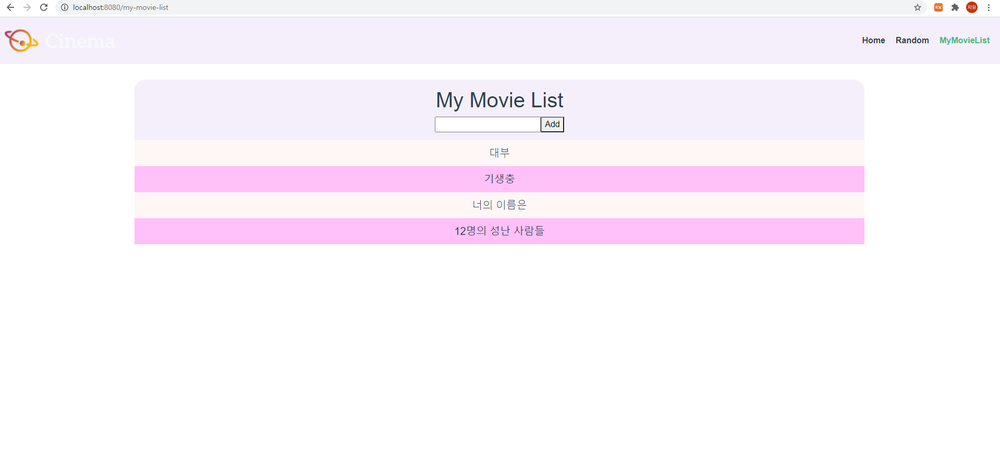

# PJT 10

### 이번 pjt 를 통해 배운 내용

* 영화 정보를 제공하는 SPA 제작

* AJAX통신과 JSON 구조에 대한 이해

* Single File Component 구조에 대한 이해 

* vue-cli, vuex, vue-router등 플러그인 활용

  

* 요구사항 :  

  A. 컴포넌트 구조

  

  B. router

  ​	i. router view

  

  C. Views & Components 

  ​	i. 아래 첨부된 UI 이미지는 예시 이미지입니다. UI 구성은 팀별로 자유롭게 진 행합니다. 

  ​	ii. vuex는 팀별로 논의 후 선택하여 사용합니다. 

  ​	iii. Home.vue

  ​		1. AJAX 통신을 이용하여 다수의 영화 데이터를 수집합니다. 

  ​		2. 수집한 영화 데이터의 포스터, 제목, 줄거리를 출력합니다.

  ​	iv. Random.vue

  ​		1. Pick 버튼을 클릭하면, 수집한 영화 데이터 중 무작위로 하나를 선택하여 출력합니다.

  ​	v. MyMovieList.vue

  ​		1. 보고싶은 영화 제목을 저장할 수 있는 컴포넌트를 구현합니다. 총 두가지 컴포넌트로 구성되어 있습니다.

  ​		2. MyListForm.vue 컴포넌트는 데이터를 입력하는 기능을 가진 컴포넌트입 니다. input 태그에 영화 제목을 입력 후, enter키 혹은 add 버튼을 클릭했을 			때 입력한 데이터를 저장합니다. 

  ​		3. MyList.vue 컴포넌트는 저장된 데이터를 출력하는 기능을 가진 컴포넌트 입니다. 사용자가 입력한 데이터를 출력합니다. 

  ​	vi. 추가적인 Styling 1. Bootstrap을 활용하여 자유롭게 스타일링 합니다.


* 결과 : 

  A. Home.vue

  ```vue
  <template>
    <div class="home">
      <div style="justify-content: center; display: flex;">
        <div class="d-flex row" style="width: 1200px;">
          <!-- 부트스트랩 사용으로 카드형식으로 출력 -->
          <movie-card class="col-4"
            v-for="movieCard in movieCards"
            :key="movieCard.id"
            :movieCard="movieCard"
            style="padding-top: 30px;"
          >
          </movie-card>
        </div>
      </div>
    </div>
  </template>
  
  <script>
  import MovieCard from '@/components/MovieCard.vue'
  import { mapState } from 'vuex'
  
  export default {
    name: 'Home',
    components: {
      MovieCard,
    },
    // 시작 시 LoadMovieCards 함수 실행
    created: function () {
      this.$store.dispatch('LoadMovieCards')
    },
    // state에서 movieCards값을 가져옴
    computed: {
      ...mapState(['movieCards'])
    }
  }
  </script>
  ```
  
  B. MovieCard.vue
  
  ```vue
  <template>
    <div>
      <div id="card">
        <!-- 부트스트랩을 사용하여 카드 내용을 출력 -->
        <b-card no-body class="overflow-hidden" style="max-width: 300px;  height: 700px;">
          <b-row no-gutters>
            <!-- 기존 str에 poster_path를 추가하여 src에 입력 -->
              <b-card-img :src="'https://image.tmdb.org/t/p/w500' + movieCard.poster_path" alt="Image" class="rounded-0" style="width: 330px;"></b-card-img>
              <b-card-body :title="movieCard.title">
                <!-- style에서 글자수가 제한 높이를 초과할 시 생략하는 overflow: hidden 사용 -->
                <b-card-text class="fw-bold text-align-start" style="overflow: hidden; font-size: 15px;">
                  {{ movieCard.overview }}
                </b-card-text>
              </b-card-body>
          </b-row>
        </b-card>
      </div>
    </div>
  </template>
  
  <script>
  export default {
    name: 'MovieCard',
    props: {
      movieCard: Object
    },
  }
  </script>
  
  <style>
  </style>
  ```
  
  C. Random.vue
  
  ```vue
  <template>
    <div>
      <button @click="getOne" style="margin: 30px 0 30px;">Pick</button>
      <div v-if="movieItem.poster_path" style="justify-content: center; display: flex;">
        <div style="border: solid; width: 336px;">
          <!-- 기존 str에 poster_path를 더하여 src에 입력 -->
          
          <h2>{{ movieItem.title }}</h2>
        </div>
      </div>
    </div>
  </template>
  
  <script>
  import { mapState } from 'vuex'
  
  export default {
    name: 'Random',
    methods: {
      // 버튼 클릭 시 getOne함수 실행
      getOne: function () {
        this.$store.dispatch('getOne')
      }
    },
    // 시작 시 영화 리스트를 가져오는 함수 실행
    created: function () {
      this.$store.dispatch('LoadMovieCards')
    },
    // state에서 다음과 같은 값을 가져옴
    computed: {
      ...mapState([
        'movieCards',
        'movieItem'
      ]),
    }
  }
  </script>
  <style>
  
  </style>
  ```
  
  D. MyMovieList.vue
  
  ```vue
  <template>
    <div style="justify-content: center; display: flex;">
      <div>
        <!-- 사용하기 -->
        <my-list-form></my-list-form>
        <my-list></my-list>
      </div>
    </div>
  </template>
  
  <script>
  // 가져오기
  import MyListForm from '@/components/MyListForm'
  import MyList from '@/components/MyList'
  export default {
    name:"MyMovieList",
    components: {
      // 등록하기
      MyListForm,
      MyList,
    }
  }
  </script>
  
  <style>
  </style>
  ```
  
  E. MyListForm.vue
  
  ```vue
  <template>
    <div id="form">
      <h1>My Movie List</h1>
      <div>
        <!-- inputData를 양방향으로 연결, trim으로 공백 제거 -->
      <input type="text" v-model.trim="inputData" @keyup.enter="addMyList">
      <button @click="addMyList">Add</button>
      </div>
    </div>
  </template>
  
  <script>
  export default {
    name:"MyListForm",
    data () {
      return {
        inputData: '',
      }
    },
    methods: {
      addMyList () {
        // 길이가 0 초과일 때 실행(입력값이 있음)
        if (this.inputData.length) {
          // actions에서 addMyList 함수 실행, inputData를 data로 전송
          this.$store.dispatch('addMyList', this.inputData)
          this.inputData=""
        }
        else {
          alert('영화를 입력해주세요')
        }
      }
    }
  }
  </script>
  
  <style>
   #form {
    border-radius: 20px 20px 0 0;
    margin-top: 30px;
    width: 1400px;
    padding: 15px 0 15px;
    background-color: rgb(244, 239, 250);
   }
  </style>
  ```
  
  F. MyList.vue
  
  ```vue
  <template>
    <div id='items'>
      <!-- 영화 리스트에 따라 자식요소 출력 -->
      <!-- 반복문에는 key값이 필수, movie요소를 movie라는 이름으로 props -->
      <my-list-item
        v-for="(movie, idx) in movieList"
        :key="idx"
        :movie="movie"
      ></my-list-item>
    </div>
  </template>
  
  <script>
  import { mapState } from 'vuex'
  import MyListItem from '@/components/MyListItem'
  
  export default {
    name:"MyList",
    components: {
      MyListItem,
    },
    // state에서 movieList값을 가져옴
    computed: {
      ...mapState([
        'movieList'
      ])
    },
  }
  </script>
  
  <style>
    #items {
      margin-top: 0px;
      width: 1400px;
      background-color: rgb(255, 193, 247);
    }
  </style>
  ```

  G. MyListItem.vue
  
  ```vue
  <template>
    <div>
      <!-- isComplete 유무에 따라 class 변경 -->
      <h3 class="item" :class="{ 'completed': movie.isCompleted }" @click="updateMovie(movie)">{{ movie.title }}</h3>
    </div>
  </template>
  
  <script>
  import { mapActions } from 'vuex'
  
  export default {
    name:"MyListItem",
    // 부모에서 movie값을 가져옴
    props: {
      movie: Object,
    },
    // actions를 map으로 가져옴
    methods: {
      ...mapActions([
        'updateMovie'
      ])
    }
  }
  </script>
  
  <style>
  /* isComplete가 True일 때 폰트 무게가 가벼워지고, 배경색이 변함 */
    .completed {
      font-weight: lighter;
      background-color: rgb(255, 246, 246);
    }
    .item  {
      margin: 0;
      line-height: 50px;
      font-size: 20px;
      height: 50px;
      width: 1400px;
    }
  </style>
  ```
  
  H. store/index.js
  
  ```js
  import Vue from 'vue'
  import Vuex from 'vuex'
  import axios from 'axios'
  import _ from 'lodash'
  
  Vue.use(Vuex)
  
  export default new Vuex.Store({
    state: {
      // TOP20 카드 리스트
      movieCards: [],
      // MyMovieList 영화 리스트
      movieList: [],
      // Random에서 사용된 영화
      movieItem: {}
    },
    mutations: {
      // movieList에 요소 append
      ADD_MY_LIST (state, data){
        const movie = {
          title: data,
          isCompleted: false,
        }
        state.movieList.push(movie)
      },
      
      // url에서 가져온 데이터를 movieCards에 대입
      LOAD_MOVIE_CARDS: function (state, results) {
        state.movieCards = results
      },
      // 클릭에 따른 isCompleted 반전
      UPDATE_MOVIE (state, data){
        state.movieList = state.movieList.map(movie => {
          if (movie === data) {
            return {
              ...movie,
              isCompleted: !movie.isCompleted
            }
          }
          else {
            return movie
          }
        })
      },
      // Random에서 사용된 함수, movieCards 중 1개를 랜덤으로 선택
      GET_ONE(state){
        state.movieItem = _.sample(state.movieCards)
      }
    },
    // mutations에서 함수를 호출
    actions: {
      addMyList (context, data){
        context.commit("ADD_MY_LIST", data)
      },
      updateMovie (context, data){
        context.commit("UPDATE_MOVIE", data)
      },
      getOne(context) {
        context.commit("GET_ONE")
      },
      // axios를 사용하여 url에서 데이터를 가져옴
      LoadMovieCards: function ({commit}) {
        axios({
          method: 'get',
          url: 'https://api.themoviedb.org/3/movie/top_rated',
          params: {
            api_key: '6163fbe091536a27c8951c10ecb40d6c',
            language: 'ko-KR',
          }
        }).then((res) => {
          // 올바른 응답 시 가져온 데이터의 데이터의 결과들을 LOAD_MOVIE_CARDS에 data로 준 후 호출
          commit('LOAD_MOVIE_CARDS', res.data.results)
        })
      }
    },
    modules: {
    }
  })
  ```
  
* 사진 : 

1. http://localhost:8080/


2. http://localhost:8080/random


3. http://localhost:8080/my-movie-list




  * 문제 접근 방법 및 코드 설명 : 영화 리스트를 출력하는데는 props를 사용, 다른 부분들은 vuex를 사용하여 데이터와 함수를 가져옴
  * 이 문제에서 어려웠던점 : js와 vue파일들을 왔다갔다 하며 작성하며 서로의 내용을 참고하는 것과 다른 vue에서 style을 변환하여 한 페이지에 구성하는 것이 어려웠음
  * 내가 생각하는 이 문제의 포인트 : 단계별로 차분히 작성하며 구조를 혼동하지 않는 것이 중요

-----

# 후기

* 파이널 프로젝트를 대비해 branch commit을 사용해봄. 페어 파트너와 코드수정파일이 겹쳐, 겹친 내용을 수정하는 것이 힘들었고, 실수로 pull을 안하고 merge를 하는 바람에 큰일이 날 뻔 했음
* vue에서 bootstrap을 사용하는 것이 색달랐음, 하지만 계속해서 css 사용에 익숙해지려고 노력함
* vue의 구조가 django보다 복잡한 것 같고 처음 배울 때는 막막했지만, 가면 갈수록 구조가 눈에 보이기 시작함.
* 오류 찾는게 힘들어 고민하다가 오류로 생각되는 부분을 모두 주석처리하고 하나씩 주석을 풀며 오류를 찾아냄, 다른 것들에 비해 오류찾기나 데이터 확인용으로 출력한 내용을 확인하는데 불편한 것 같음.

